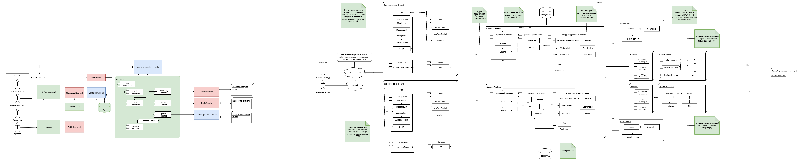

# Gonets

## Описание

Гибридная система связи. Отправка голосовых и текстовых сообщений, а также координат.

*В данном репозитории представлена небольшая часть проекта без реализации передачи данных по каналам связи*

## Какие каналы используются

- **Спутниковый канал - ГОНЕЦ**
- **Радиоканал с радиоресиверами ARDOP**
- **Internet**

## Что используется

- **Net8.0**
- **PostgreSQL**
- **Docker**
- **RabbitMQ**
- **LPCNet**
- **React (npx, npm)**
- **Абонентский терминал гонец АТ-МН-2.1**

## Краткие сведения

Документация спутниковой системы "ГОНЕЦ": https://gonets.ru/rus/uslugi/terminals/sputnikovye-terminaly/
Документация радиопротокола ARDOP: https://github.com/pflarue/ardop/tree/master

## Схема системы связи



## Формат очередей

формат для статуса каналов: channel_status

*Конфиденциальная информация*

формат для статуса сообщений: outgoing_messages

*Конфиденциальная информация*

## Конфигурация
### Настройка apsettings.json

*Конфиденциальная информация*

## Сборка и запуск

**Сборка через Docker**

Скачать Docker, NET8.0 (для бэка), nodejs и npm (для фронта) - PostgreSQL, RabbitMQ, pgadmin, certs должны скачаться при сборке (если не скачано). Склонировать репозиторий, перейти в *gonets/docker-compose.yml*
- **Клиент**
Убрать сборку *OperarotBackend*:
```
  operatorbackend:
    build:
      context: ./OperatorBackend
      args:
        ASPNETCORE_ENVIRONMENT: Docker
    environment:
      ASPNETCORE_ENVIRONMENT: Docker
      ASPNETCORE_URLS: http://+:7000,https://+:7001
    volumes:
      - ./certs:/https:ro
    ports:
      - "7000:7000"
      - "7001:7001"
    depends_on:
      - rabbitmq
    networks:
      - app_network
    restart: unless-stopped
```
- **Оператор**
Убрать сборку для *ClientBackend*:
```
  clientbackend:
    build:
      context: ./ClientBackend
      args:
        ASPNETCORE_ENVIRONMENT: Docker
    environment:
      ASPNETCORE_ENVIRONMENT: Docker
      ASPNETCORE_URLS: http://+:6000;https://+:6001
    volumes:
      - ./certs:/https:ro
    ports:
      - "6000:6000"
      - "6001:6001"
    depends_on:
      - rabbitmq
    networks:
      - app_network
    restart: unless-stopped
```
После изменения *docker-compose.yml* можно собирать проект:
```
    docker compose up -d --build
```
restart: unless-stopped - контейнер будет перезапущен, если не был остановлен вручную.

**Сборка отдельных проектов**

Запуск и сборка каждого проекта через *dotnet build/run*. Для такой сборки используются *apsettings.json* (см. конфигурацию). Все используемые компоненты скачивать отдельно.
